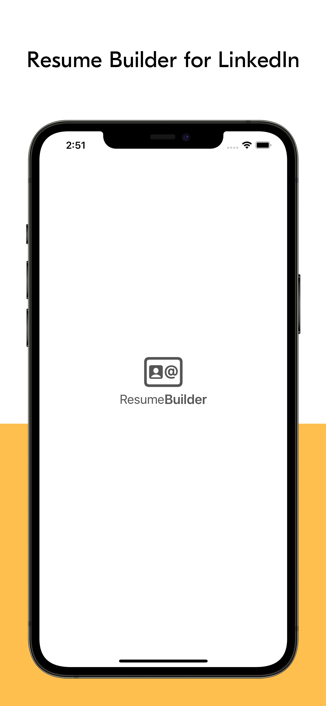
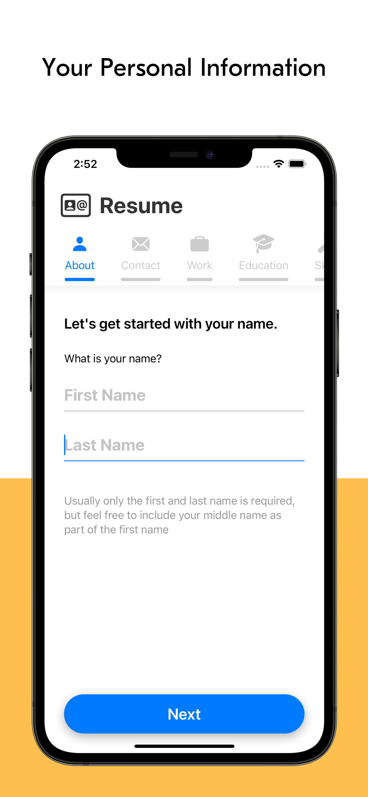
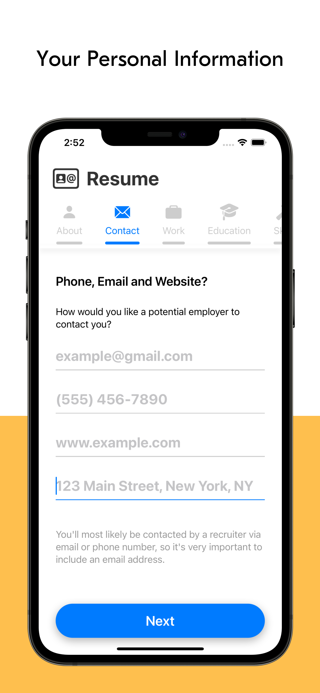
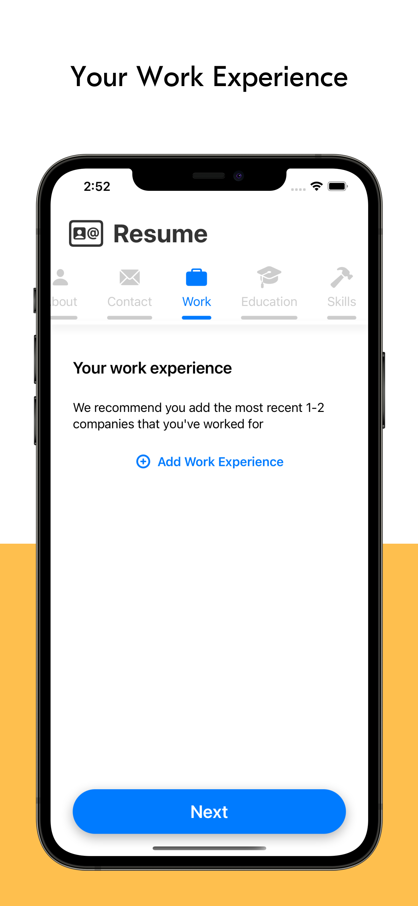
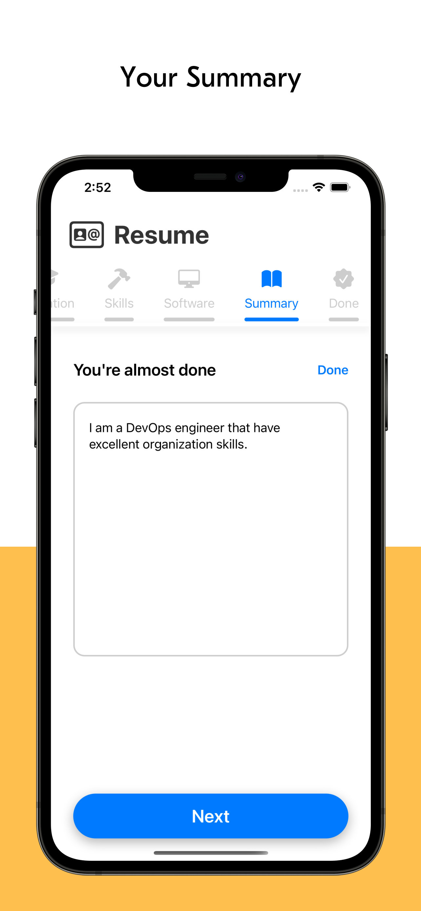
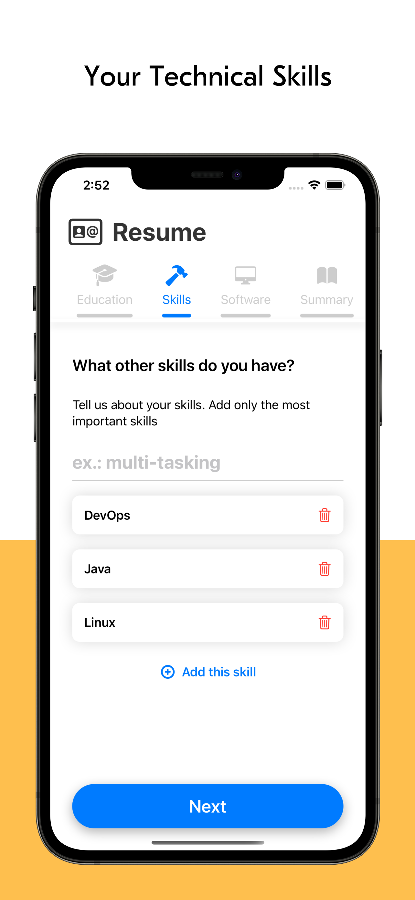
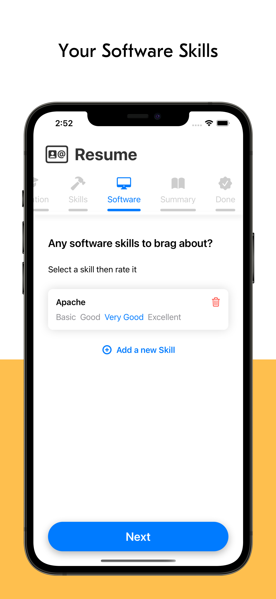

# ResumeBuilderUI
Resume Builder UI (Swift)

<table>
    <tr>
        <td></td>
        <td></td>
        <td></td>
    </tr>
    <tr>
        <td></td>
        <td></td>
        <td></td>
    </tr>
    <tr>
        <td></td>
    </tr>
</table>

# Description

The Resume Builder for LinkedIn users is an iOS mobile application that offers a great user experience for building your ideal template to earn your job of your preference.

LinkedIn has a lot of jobs worldwide, but it is needed to upload a great material including in your CV with no time.

Your job-hunting is already started on LinkedIn. Good luck!

Resume Builder - Professionals is the next social network for professionals that like LinkedIn networks and groups. Build your professional network based on Resume Builder, connect with anyone, and use your professional profile as an online resume with Apple Sign-In, Google Sign-In, Microsoft Sign-In and GitHub for developer professionals.

JOB SEARCH

• Search and apply to millions of job openings including your responsive resume
• Upload and easily submit your resume to jobs that fit on LinkedIn jobs
• Save searches and create alerts to be the first to know about new job openings and worldwide events

The Resume Builder - Professionals app has a low cost to use and download.

---------------------------

There are no additional subscriptions or premium plans. Find a job, create your business, find and hire the new talented persons worldwide with a really low cost on 4.99 $ all over the world.

Privacy Policy: https://opendevops.dev/

Terms of Service: https://opendevops.dev/

# Product Hunt

https://www.producthunt.com/posts/resume-builder-professionals/maker-invite?code=QO0MjN

